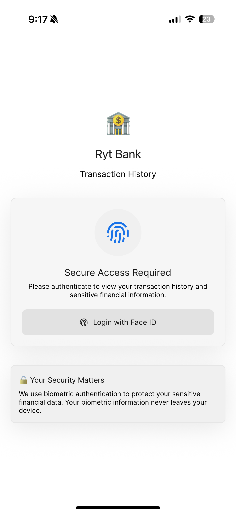
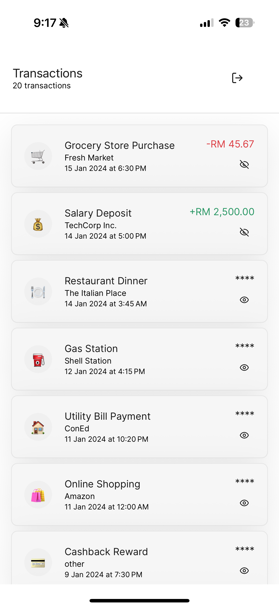
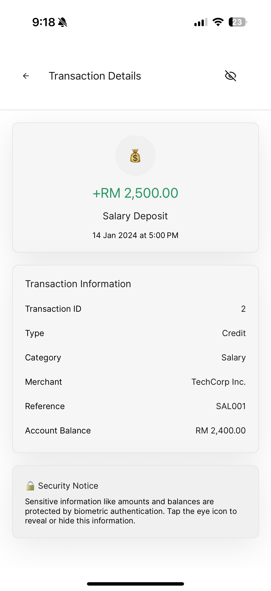

# Transaction History Module - Ryt Bank

A secure React Native transaction history module built with TypeScript and Tamagui, featuring biometric authentication for sensitive financial data protection.

  

## Features

### 🔐 Security & Authentication
- **Biometric Authentication**: Face ID and Fingerprint device biometrics
- **Sensitive Data Protection**: Transaction amounts and balances are masked by default
- **Session Management**: 5-minute authentication timeout for security
- **Secure Storage**: Authentication state persisted securely

### 📱 User Interface
- **Modern Design**: Built with Tamagui for consistent, beautiful UI

### 💳 Transaction Management
- **Transaction List**: Paginated list with pull-to-refresh
- **Transaction Details**: Comprehensive transaction information
- **Real-time Formatting**: Currency and date formatting
- **Category Icons**: Visual transaction categorization

### 🛡️ Error Handling
- **Comprehensive Error Management**: Custom error classes and handling
- **User-Friendly Messages**: Clear error communication

## Project Structure

```
transaction-history/
├── components/
│   └── TransactionItem.tsx          # Individual transaction list item
├── data/
│   └── mockTransactions.ts          # Sample transaction data (25+ transactions)
├── screens/
│   ├── LoginScreen.tsx              # Biometric authentication screen
│   ├── TransactionHistoryScreen.tsx # Main transaction list screen
│   └── TransactionDetailScreen.tsx  # Detailed transaction view
├── services/
│   ├── authService.ts               # Authentication service
│   └── transactionService.ts       # Transaction data service
├── types/
│   └── transaction.ts               # TypeScript type definitions
├── tamagui.config.ts                # UI theme configuration
└── App.tsx                          # Main application component
```

## Technology Stack

- **React Native**: Cross-platform mobile development
- **TypeScript**: Type safety and improved developer experience
- **Tamagui**: Modern UI library with theming
- **Expo**: Development platform and tools


## Installation & Setup

1. **Clone the repository**
   ```bash
   git clone https://github.com/hazimhafis/transaction-history.git
   cd transaction-history
   ```

2. **Install dependencies**
   ```bash
   pnpm install
   ```

3. **Start the development server**
   ```bash
   pnpm start
   ```

4. **Scan the QR code and test the app on your mobile device**

##Known Limitation for iOS Face ID in Expo Go
- The FaceID authentication for iOS is not supported in Expo Go. So it will trigger the passcode by default
- https://docs.expo.dev/versions/latest/sdk/local-authentication/#ios
  


## Usage

### Initial Authentication
1. Launch the app to see the login screen
2. Tap "Authenticate with [Biometric Type]" button
3. Complete biometric authentication on your device
4. Access granted to transaction history

### Viewing Transactions
1. Browse the paginated transaction list
2. Pull down to refresh transactions
3. Tap any transaction to view details
4. Use the eye icon to reveal/hide sensitive amounts

### Transaction Details
1. View comprehensive transaction information
2. Authenticate to reveal sensitive data (amounts, balances)
3. Navigate back to the transaction list

### Security Features
- Amounts are masked by default with "****"
- Biometric authentication required to reveal sensitive data
- Automatic session timeout after 5 minutes
- Secure logout functionality

## Sample Data

The app includes 25+ sample transactions with various:
- **Transaction Types**: Debit and Credit
- **Categories**: Grocery, Restaurant, Gas, Shopping, Entertainment, etc.
- **Merchants**: Real-world merchant names
- **Locations**: Geographic locations
- **Date Range**: Recent transactions spanning several months

## API Structure

### Transaction Interface
```typescript
interface Transaction {
  id: string;
  amount: number;
  date: string;
  description: string;
  type: 'debit' | 'credit';
  category: TransactionCategory;
  merchant?: string;
  location?: string;
  reference?: string;
  balance?: number;
}
```

### Authentication Service
- `initialize()`: Setup biometric authentication
- `authenticateWithBiometrics()`: Perform biometric auth
- `isAuthenticated()`: Check authentication status
- `logout()`: Clear authentication state

### Transaction Service
- `getTransactions(page, limit)`: Paginated transaction retrieval
- `getTransactionById(id)`: Single transaction details
- `refreshTransactions()`: Refresh transaction data
- `searchTransactions(query)`: Search functionality

## Security Considerations

1. **Biometric Data**: Never stored or transmitted, stays on device
2. **Session Management**: Automatic timeout prevents unauthorized access
3. **Data Masking**: Sensitive information hidden by default
4. **Error Handling**: No sensitive data exposed in error messages
5. **Local Storage**: Authentication state encrypted in AsyncStorage


## License

This project is proprietary to Ryt Bank. All rights reserved.